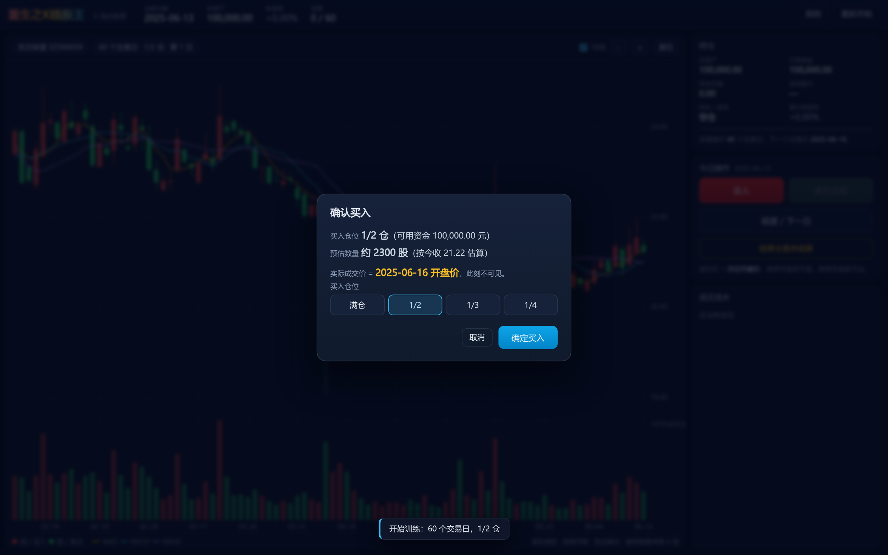

# 重生之K线股王 · K 线训练营

用**真实历史行情**（通达信本地日线，已前复权）做逐日推演的 K 线交易训练：随机抽一只股票、随机抽一个日期，
你只能看到已经"发生"的 K 线，每一笔买卖都以**次日开盘价**成交，30 / 60 / 90 个交易日后结算，最终收益率一键揭晓。

纯静态站点，无后端、无第三方依赖，直接托管在 GitHub Pages 上即可。


<p align="center">
  
  
  
</p>

---

## 一、玩法

1. **开局设置**
   - 股票：`随机股票`（隐藏名称与代码，结算后才揭晓）或 `指定代码`（可输入代码 / 名称检索）。
   - 仓位：满仓 / 1/2 / 1/3 / 1/4，表示每次买入动用「当前总资产」的比例。
   - 操作交易日：30 / 60 / 90 个交易日。
   - 初始资金（默认 10 万）、是否计入交易费用。
2. **读图**：随机日期**之前 3 个月**（≈60 个交易日）的 K 线与成交量柱会画出来，之后每天揭示一根。
3. **做决策**：每天可 `买入` / `卖出全部` / `观望`；点确定后揭示下一日 K 线，并**以下一日开盘价成交**，
   图上留下 `B` / `S` 标记，右侧实时显示浮动盈亏与累计收益率。
4. **结束**：点`结束交易并结算`（有持仓则按次日开盘价清仓）或走满窗口自动结算，
   结算面板用大号数字突出**最终收益率**，并给出胜率、最大回撤、同期个股涨跌幅等。

### 交易规则（与页面「规则」面板同源）

| # | 规则 |
|---|---|
| 1 | 价格均为**前复权**价（除权除息缺口被抹平，最新价不变），因此涨跌幅、形态连续可比。 |
| 2 | 决策只能基于已揭示的 K 线，**不使用任何未来数据**。 |
| 3 | 买入 / 卖出 / 结束交易清仓**一律以次日开盘价成交**；观望直接进入下一日。 |
| 4 | 仓位按当前总资产比例下单，同时受可用现金约束，按一手 = 100 股向下取整。 |
| 5 | **涨停开盘无法买入、跌停开盘无法卖出**（主板 ±10%，创业板/科创板 ±20%）。委托被拒时当日不推进，需重新决策。 |
| 6 | 卖出为全部清仓；「次日开盘成交」天然满足 T+1。 |
| 7 | 走满 30/60/90 个交易日自动结算，剩余持仓按最后一日收盘价折算为现金。 |
| 8 | 交易费用（可关闭）：佣金万 2.5（单笔最低 5 元）+ 过户费万 0.1，卖出另收印花税千 0.5。 |

### 选样口径

- 标的：沪深 A 股（主板 / 创业板 / 科创板）。
- 已剔除：**北交所、B 股、当前名称含 ST 的股票、上市不足 250 个交易日的次新股**。
- 随机日期区间：`2024-12-02 ~ 2026-09-01`，且必须满足「之前有 60 根 K 线、之后留有整个操作窗口」。
- 若抽中的窗口内存在**长期停牌**（相邻 K 线自然日间隔 > 15 天）会自动重抽，避免 30/60/90 日窗口失真。

---

## 二、目录结构

```
kline-camp/
├── docs/                     ← GitHub Pages 站点根目录
│   ├── index.html            页面骨架
│   ├── css/app.css           深色主题（红涨绿跌）
│   ├── js/decode.js          KLC1 二进制行情解码
│   ├── js/sim.js             训练仿真引擎（纯逻辑，可在 Node 里测）
│   ├── js/chart.js           Canvas K线 + 成交量 + 标记 + 十字光标
│   ├── js/app.js             主控制器（设置 / 下单 / 结算 / 渲染）
│   └── data/                 构建产物：{code}.bin × 4997 + index.json + manifest.json
├── src/                      数据层（复用 workspace 既有 stockpick 工程实现）
│   ├── tdx.py                通达信 .day / .lc5 / .lc1 读取
│   ├── adj.py                gbbq 除权除息 → 前复权累计因子
│   └── universe.py           板块 / 资产类别判定
├── tools/build_data.py       构建 docs/data（读本地日线 → 前复权 → 量化打包）
├── tools/dump_fixture.py     导出对照样本，供前端解码器回归测试
├── tests/                    Node 单元测试（解码 + 仿真账目）
└── data/cache/               复权因子 npz 缓存（已 gitignore，可重建）
```

---

## 三、数据构建

数据源为本地通达信安装目录（默认 `/mnt/g/new_tdx`，可用环境变量覆盖）：

| 用途 | 路径 |
|---|---|
| 日线 | `vipdoc/{sh,sz,bj}/lday/*.day`（32 字节/条） |
| 权息 | `T0002/hq_cache/gbbq` |
| 名称 | `T0002/hq_cache/infoharbor_ex.code` |

```bash
# 依赖：numpy + pytdx（本仓库使用 workspace 根虚拟环境 .venv_tdx）
python tools/build_data.py            # 全量构建，约 70 秒，产出 docs/data/
python tools/build_data.py --limit 50 # 只构建前 50 只（调试）
python tools/dump_fixture.py 600000   # 导出解码对照样本
```

构建脚本内置自检：每只股票打包后立刻用独立解码器还原，与源数据逐根比对。
本次构建结果见 `docs/data/manifest.json`：

```
股票 4997 只 / 2,453,350 根 bar / 29.6 MB
价格重建最大误差 0.0146 元，成交量重建最大相对误差 7.8e-05
```

### 二进制格式 KLC1（全部小端，32 + 12n 字节）

| 偏移 | 类型 | 含义 |
|---|---|---|
| 0 | 4s | magic `KLC1` |
| 4 | u32 | bar 数 n |
| 8 | u32 | 首根日期 `YYYYMMDD` |
| 12 / 16 | f32 | 价格量化下界 `pmin` / 步长 `pstep` |
| 20 / 24 | f32 | 成交量量化下界 `vmin` / 步长 `vstep`（对数空间） |
| 28 | u32 | 保留 |
| 32 | u16 × n | `gap`：与上一根 bar 的自然日间隔（首根为 0） |
| … | u16 × n | `open` / `high` / `low` / `close` 量化价 |
| … | u16 × n | `vol` 量化量 |

- `date[i] = date0 + Σ gap[0..i]`（自然日，可还原真实交易日与停牌缺口）
- `price = pmin + q × pstep`，`vol = exp(vmin + q × vstep)`（单位：股）

单只股票约 **6 KB**，一次训练只下载这一只，30 天窗口下页面首屏≈60 KB。

---

## 四、本地预览 / 测试

```bash
# 预览（必须走 HTTP，fetch 不支持 file://）
python3 -m http.server 8123 --directory docs
# 然后打开 http://127.0.0.1:8123/

# 单元测试（Node ≥ 20）
node --test tests/sim.test.js tests/decode.test.js tests/integration.test.js
# 或
npm test
```

测试覆盖：二进制解码与 Python 侧逐根比对、K 线自身一致性、随机区间与停牌过滤、
次日开盘成交、仓位与一手取整、涨跌停拒单、费用公式、期满自动结算、
手动结束清仓、长程随机操作的**账目守恒**（现金不为负、总资产 = 现金 + 持仓市值），
以及用**真实构建产物**跑 300 局随机训练，确认不会读到未来数据。

可选的浏览器端到端冒烟测试（需要 puppeteer + Chrome）：

```bash
npm i -D puppeteer && npx puppeteer browsers install chrome-headless-shell
CHROME_PATH=<chrome-headless-shell 路径> node tests/e2e/browser.mjs
```

它会真的点开页面、抽股票、下单、结算，并检查画布上确实画出了红绿 K 线与买卖标记。

---

## 五、部署到 GitHub Pages

```bash
cd kline-camp
git add -A
git commit -m "feat: 重生之K线股王 K线训练营"
git remote add origin git@github.com:<你的用户名>/kline-camp.git
git push -u origin main
```

然后在仓库页面：**Settings → Pages → Build and deployment**
- Source: `Deploy from a branch`
- Branch: `main`，目录选 **`/docs`**
- 稍等 1~2 分钟，访问 `https://<你的用户名>.github.io/kline-camp/`

> `docs/.nojekyll` 已就位，避免 Jekyll 处理 `data/` 下的大量二进制文件。

---

## 六、已知口径与偏差（务必知悉）

1. **前复权基于「当前」权息表**：`prices(t) = 原始价(t) × Π_{除权日 > t} 因子`，最新价不变、历史价等比缩放。
   绝对价位与当年真实盘面不同，但**涨跌幅与形态完全一致**，不影响训练。
2. **ST 只有当前快照**：通达信 `infoharbor_ex.code` 只提供今天的名称，没有历史名称表。
   用「当前是否 ST」过滤历史样本属于已知偏差（一只 2023 年才 ST 的股票，在 2022 年的样本里也会被剔除）。
   这是本训练营为了避开 5% 涨跌幅与退市风险样本而做的取舍。
3. **不含退市股**：退市股不在当前名称表中，`infoharbor_ex.code` 里没有它们，故未纳入。
4. **不剔除幸存者偏差**：随机抽样按「股票+日期」等权，不做任何未来信息筛选（除了上述 ST / 次新规则）。
5. **价格量化误差 ≤ 0.015 元**（个别高价股），成交量相对误差 < 0.01%，显示与成交计算足够精确。
6. **未使用分钟线**：`vipdoc/*/fzline` 的 5 分钟数据仅覆盖 2024-11 至今，全市场打包体积过大（GB 级），
   本版本只用日线；数据层 `src/tdx.py` 已支持 `.lc5`，后续要做分时训练可在此扩展。
7. **停牌、涨跌停按前复权价判定**：涨跌幅比例不变，但涨跌停价的"分"级四舍五入与真实历史可能差 1 分。

---

## 七、许可与致谢

- 数据层 `src/tdx.py`、`src/adj.py`、`src/universe.py` 复用自本 workspace 的 `stockpick` 项目工程实现。
- 行情数据来自用户本地通达信安装目录，仅供个人研究学习使用。
