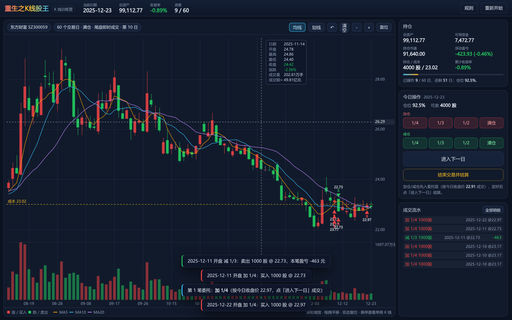
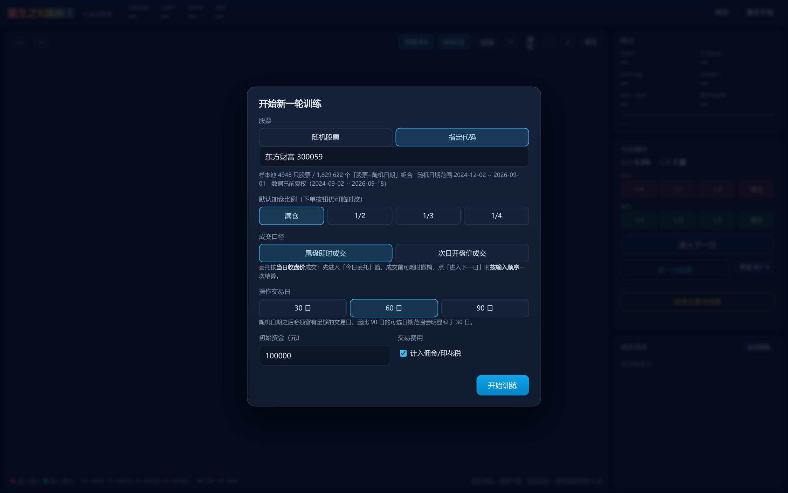
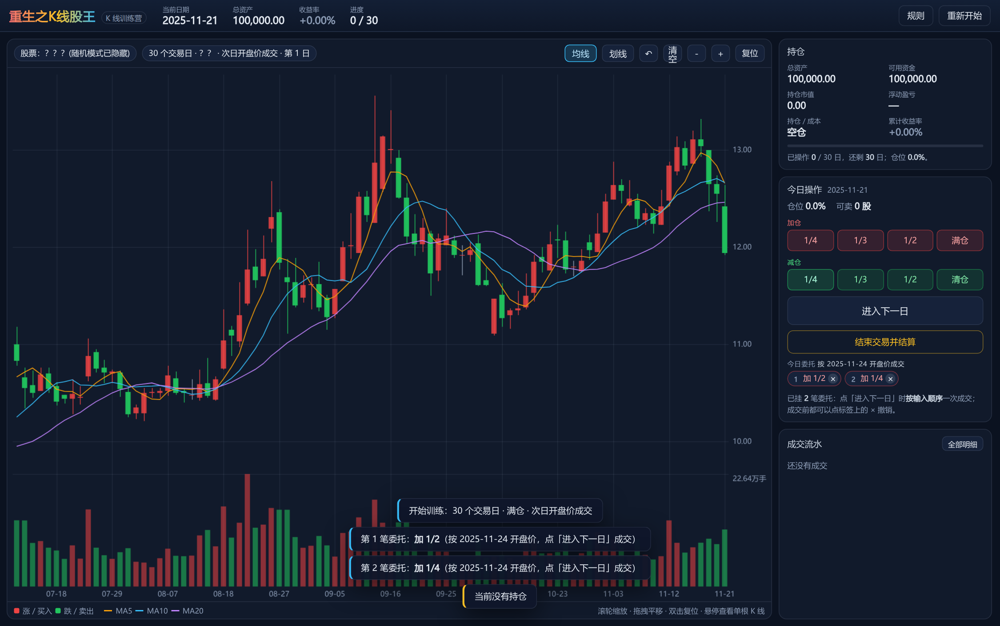
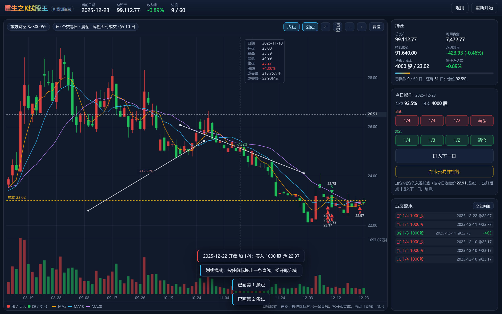
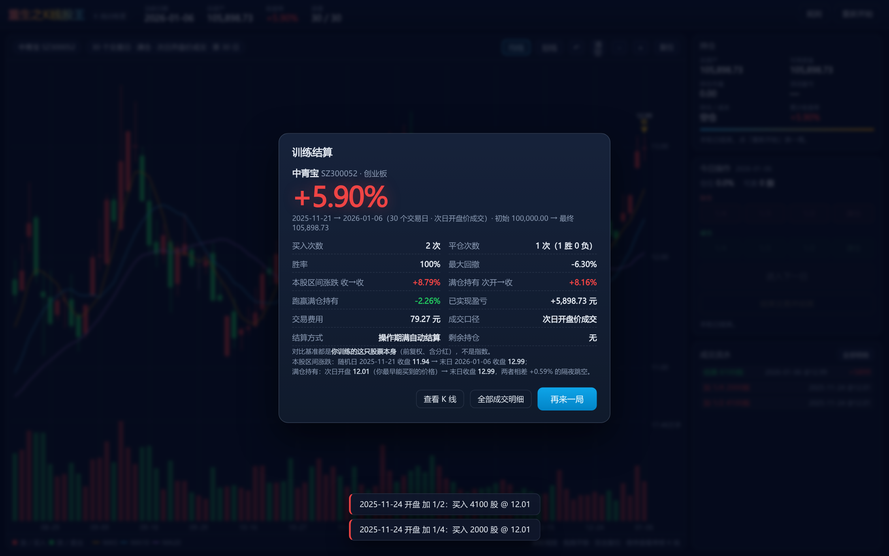
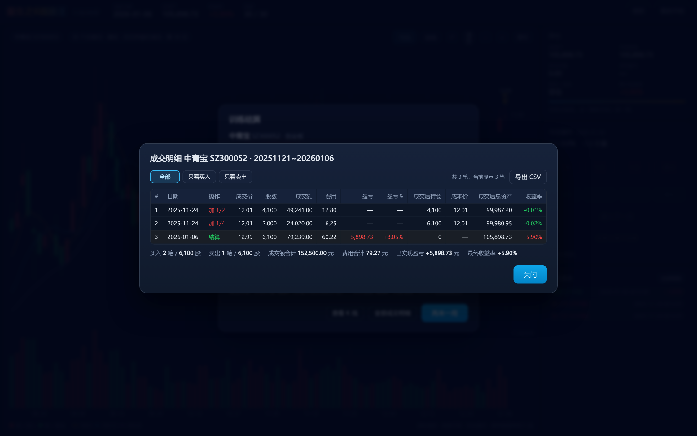

# 重生之K线股王 · K 线训练营

用**真实历史行情**（通达信本地日线，已前复权）做逐日推演的 K 线交易训练：随机抽一只股票、随机抽一个日期，
你只能看到已经"发生"的 K 线，**同一天可以反复加仓 / 减仓把仓位调到想要的位置**，30 / 60 / 90 个交易日后结算，
最终收益率一键揭晓。




<p align="center">
  
  
  
</p>
<p align="center">
  
  
</p>

---

## 一、玩法

1. **开局设置**
   - 股票：`随机股票`（隐藏名称与代码，结算后才揭晓）或 `指定代码`（可输入代码 / 名称检索）。
   - 默认加仓比例：满仓 / 1/2 / 1/3 / 1/4（下单时仍可用按钮临时改）。
   - **成交口径**：`尾盘即时成交` 或 `次日开盘价成交`（见下方规则，这是两种不同训练模式）。
   - 操作交易日：30 / 60 / 90 个交易日；初始资金（默认 10 万）、是否计入交易费用。
2. **读图与画线**：随机日期**之前 3 个月**（≈60 个交易日）的 K 线与成交量柱会画出来，之后每天揭示一根。
   图上方工具栏：`均线`（MA5/10/20，**默认打开**，点一下可关）、`划线`、`↶`（撤销上一条）、
   `清空`、`－`/`＋`（缩放）、`复位`。
   **划线**：点 `划线` 进入划线模式，在图上**按住鼠标拖出一条直线，松开即完成**（可画多条）；
   线中点会标出这条线两端的价格涨跌。画线锚在**数据坐标**（K 线位置 + 价格），
   缩放、平移、进入下一日都不会漂。再点一次 `划线` 退出，退出后拖拽恢复为平移。
3. **下委托**：每天有 `加仓 1/4 · 1/3 · 1/2 · 满仓` 与 `减仓 1/4 · 1/3 · 1/2 · 清仓` 八个按钮，
   点一下就往「**今日委托**」篮里加一笔（带 1/2/3… 顺序号）；
   成交前可以随时点标签上的 `×`（或按 `Z`）撤销。
   **点 `进入下一日` 时委托才按输入顺序一次成交**，同时揭示下一根 K 线，图上留下 `B` / `S` 标记与成本线。
4. **结束**：点`结束交易并结算`或走满窗口自动结算，
   结算面板用大号数字突出**最终收益率**，并给出胜率、最大回撤与两个对比基准。
5. **复盘**：结算后点 `全部成交明细`（侧栏「成交流水」右上角也有入口），
   逐笔查看每次买卖的**日期 / 操作 / 成交价 / 股数 / 成交额 / 费用 / 盈亏 / 盈亏% /
   成交后持仓 / 成本价 / 成交后总资产 / 收益率**，可按买入/卖出筛选，并一键 `导出 CSV`（Excel 直接打开）。

### 结算面板里的对比基准是什么

两个基准用的都是**你训练的这只股票本身**（前复权价，因此比率等于含分红再投的真实区间收益），**不是指数**：

| 指标 | 起算价 | 结束价 | 用途 |
|---|---|---|---|
| **本股区间涨跌**（收→收） | 随机日期**收盘价**（你看到的第一天，此时还不能交易） | 最后一日收盘价 | 中性参照：这段行情本身涨跌了多少 |
| **满仓持有**（次开→收） | 随机日期**次日开盘价**（你最早能买到的价格） | 最后一日收盘价 | 与你的收益率 apples-to-apples 的基准 |
| **跑赢满仓持有** | — | — | 你的收益率 − 满仓持有收益 |

两者只差**一个隔夜跳空**（随机日收盘 → 次日开盘）。实测例：

| 股票 | 随机日收盘 | 次日开盘 | 末日收盘 | 本股区间涨跌 | 满仓持有 |
|---|---|---|---|---|---|
| 博腾股份 300363 | 17.11 | 17.03 | 23.72 | +38.65% | +39.30% |
| 贵州茅台 600519 | 1378.35 | 1382.56 | 1369.59 | −0.64% | −0.94% |
| 平安银行 000001 | 10.13 | 10.13 | 10.76 | +6.17% | +6.17% |

### 交易规则（与页面「规则」面板同源）

| # | 规则 |
|---|---|
| 1 | 价格均为**前复权**价（除权除息缺口被抹平，最新价不变），因此涨跌幅、形态连续可比。 |
| 2 | 决策只能基于已揭示的 K 线，**不使用任何未来数据**。 |
| 3 | **下单方式（两种口径完全一样）**：加仓 / 减仓都先进入「今日委托」篮，**点 `进入下一日` 时才统一结算**；成交前可逐笔撤销。买入连一手都买不起时会当场拦下，不让它进篮。 |
| 4 | **成交价口径二选一**（开局设置，只差价格、不差流程）：<br>· **尾盘即时成交**——按**今日收盘价**成交（提交时价格已可见）；<br>· **次日开盘价成交**——按**次日开盘价**成交。 |
| 5 | 同一天挂多笔委托时**严格按输入顺序**逐笔计算（不做"先卖后买"的重排），委托篮里的编号就是计算顺序 —— 所以「先清仓再买回」和「先买回再清仓」结果不同。 |
| 6 | **加仓**：加 1/4 / 1/3 / 1/2 = 买入「当前总资产 × 比例」，`满仓` = 用光全部可用现金。 |
| 7 | **减仓**：减 1/4 / 1/3 / 1/2 = 卖出「当前可卖持仓 × 比例」，`清仓` = 卖出全部可卖持仓。均按一手 100 股向下取整，成交那一刻按实时可卖量重算。 |
| 8 | **T+1**：同一批委托里刚买入的股票，当批不能再卖出（例如同批「先加仓再清仓」，清仓只会卖掉原本的底仓）。 |
| 9 | **涨停买不进、跌停卖不出**（主板 ±10%，创业板/科创板 ±20%）：尾盘口径看当日收盘是否封板，开盘口径看次日开盘价。 |
| 10 | 走满 30/60/90 个交易日自动结算，剩余持仓按最后一日收盘价折算为现金。 |
| 11 | `结束交易`：两种口径都会**放弃今日未成交委托**；尾盘按当收清仓结算，开盘口径按次日开盘价清仓。 |
| 12 | 交易费用（可关闭）：佣金万 2.5（单笔最低 5 元）+ 过户费万 0.1，卖出另收印花税千 0.5。 |

> **关于「尾盘即时成交」的诚实说明**：它是"看到当日收盘价之后，再按这个收盘价成交"的近似
> （实盘里相当于尾盘集合竞价挂单，不完全等价）。它和「次日开盘价成交」的**交互流程完全相同**，
> 唯一区别就是成交价；如果你要求严格「零未来信息」，请在开局设置里选 `次日开盘价成交`。

### 选样口径

- 标的：沪深 A 股（主板 / 创业板 / 科创板）。
- 已剔除：**北交所、B 股、当前名称含 ST 的股票、上市不足 250 个交易日的次新股**。
- 随机日期区间：`2024-12-02 ~ 2026-09-01`，且必须满足「之前有 60 根 K 线、之后留有整个操作窗口」。
- 若抽中的窗口内存在**长期停牌**（相邻 K 线自然日间隔 > 15 天）会自动重抽，避免 30/60/90 日窗口失真。

---

## 二、目录结构

```
kline-camp/
├── docs/                     ← GitHub Pages 站点根目录
│   ├── index.html            页面骨架
│   ├── css/app.css           深色主题（红涨绿跌）
│   ├── js/decode.js          KLC1 二进制行情解码
│   ├── js/sim.js             训练仿真引擎（下单/推进分离、双成交口径、加减仓、T+1、成交快照）
│   ├── js/chart.js           Canvas K线 + 成交量 + 标记 + 均线开关 + 手动划线 + 十字光标
│   ├── js/app.js             主控制器（设置 / 下单 / 结算 / 渲染）
│   └── data/                 构建产物：{code}.bin × 4997 + index.json + manifest.json
├── src/                      数据层（复用 workspace 既有 stockpick 工程实现）
│   ├── tdx.py                通达信 .day / .lc5 / .lc1 读取
│   ├── adj.py                gbbq 除权除息 → 前复权累计因子
│   └── universe.py           板块 / 资产类别判定
├── tools/build_data.py       构建 docs/data（读本地日线 → 前复权 → 量化打包）
├── tools/dump_fixture.py     导出对照样本，供前端解码器回归测试
├── tools/verify_data.py      价格链路独立审计（自己解析 .day、自己算复权因子）
├── tools/verify_sim.py       股数/资金/收益率对账（Python 独立重放前端流水）
├── tools/gen_transcript.mjs  导出前端引擎的交易流水，供上面的对账使用
├── tests/                    Node 单元/集成测试 + 浏览器端到端
└── data/cache/               复权因子 npz 缓存（已 gitignore，可重建）
```

---


## 三、本地预览 / 测试

```bash
# 预览（必须走 HTTP，fetch 不支持 file://）
python3 -m http.server 8123 --directory docs
# 然后打开 http://127.0.0.1:8123/

# 单元测试（Node ≥ 20）
node --test tests/sim.test.js tests/decode.test.js tests/integration.test.js
# 或
npm test
```

测试覆盖：二进制解码与 Python 侧逐根比对、K 线自身一致性、随机区间与停牌过滤、
两种成交口径下的成交价、委托篮撤销与「先卖后买」换仓、同日反复加减仓、T+1 拦截、
一手取整、涨跌停拒单、费用公式、期满自动结算、手动结束清仓、长程随机操作的**账目守恒**
（现金不为负、总资产 = 现金 + 持仓市值），以及用**真实构建产物**跑 300 局随机训练，
确认不会读到未来数据。

可选的浏览器端到端冒烟测试（需要 puppeteer + Chrome）：

```bash
npm i -D puppeteer && npx puppeteer browsers install chrome-headless-shell
CHROME_PATH=<chrome-headless-shell 路径> node tests/e2e/browser.mjs
```

它会真的点开页面、抽股票、同日连续加仓、验证 T+1 拦截、切换成交口径、撤销委托、结算，
并检查画布上确实画出了红绿 K 线与买卖标记。

---


## 四、数值审计（可复跑）

价格与账目都用**独立实现**复核过，不依赖被测代码自证：

| 命令 | 复核对象 | 做法 |
|---|---|---|
| `python tools/verify_data.py 300` | 开盘 / 最高 / 最低 / 收盘价 | 自己 unpack `.day`、自己按除权公式算因子，再与 `docs/data/*.bin` 逐根比对 |
| `python tools/verify_sim.py 20` | 股数 / 现金 / 成本基准 / 收益率 / 费用 | Node 跑前端引擎出流水 → Python 用另一套记账实现逐步重放比对 |

最近一次结果（窗口 2024-09-02 ~ 2026-09-18）：

- **价格**：300 只 / 147,415 根 bar。uint16 量化 + 取整到「分」后的重建误差中位 **0.005 元**、最大 0.009 元；
  折算成收益率误差中位 0.031%、最大 **0.35%**（可忽略）。
- **日期**：与原始 `.day` 逐根一致，0 处不符。
- **前复权**：300/300 只末根因子 = 1.0（"最新价不变"成立）；
  571 个除权日里，复权后的**真实涨跌幅中位 0.000%**、最大 20.04%（科创板 20% 停板内），越界 0 个
  —— 派现 / 送转造成的缺口被精确抹平，这是不依赖公式本身的非循环证据。
- **成交量单位**：`amount / vol` 落在当日 `[low, high]` 内的比例 **99.999%**（单位若搞错会接近 0）。
- **股数 / 资金 / 收益率**：20 只 × 2 种成交口径 × 约 80 步 = **28,800 个数值逐一比对，全部一致**；
  另外校验了恒等式 `总资产 − 本金 == 已实现盈亏 + 浮动盈亏`（成本基准按股数比例分摊的正确性），
  以及"每笔买入股数都是 100 的整数倍、含费用支出不超过成交前现金"。
- **成交额**：本地只打包 OHLCV，没有真实 `amount`。页面用典型价 `(H+L+C)/3 × 量` 估算，
  与真实成交额的中位偏差 0.198%、99 分位 1.66%，页面上标注为 **成交额≈**。

> 审计过程中抓到并修掉一个真实缺陷：**`减 1/3` 在持仓不足约 3000 股时会因浮点误差少卖一手**
> （持仓 300 股时甚至会变成"不足一手"）。现在按钮传精确分数 `1/3`，取整函数 `lotFloor` 也对
> 浮点边界做了保护。同一轮还修正了"跑赢个股"的基准口径 —— 改用与玩家同样首个可成交价的
> **满仓持有收益**做对比，避免拿"随机日收盘"去比"次日开盘成交"。

---

## 五、已知口径与偏差（务必知悉）

1. **前复权基于「当前」权息表**：`prices(t) = 原始价(t) × Π_{除权日 > t} 因子`，最新价不变、历史价等比缩放。
   绝对价位与当年真实盘面不同，但**涨跌幅与形态完全一致**，不影响训练。
2. **ST 只有当前快照**：通达信 `infoharbor_ex.code` 只提供今天的名称，没有历史名称表。
   用「当前是否 ST」过滤历史样本属于已知偏差（一只 2023 年才 ST 的股票，在 2022 年的样本里也会被剔除）。
   这是本训练营为了避开 5% 涨跌幅与退市风险样本而做的取舍。
3. **不含退市股**：退市股不在当前名称表中，`infoharbor_ex.code` 里没有它们，故未纳入。
4. **不剔除幸存者偏差**：随机抽样按「股票+日期」等权，不做任何未来信息筛选（除了上述 ST / 次新规则）。
5. **价格精度**：前端读数据时会把价格**取整到「分」**（A 股真实报价就是 0.01 一跳），
   这样 `成交价 × 股数 = 成交额`、`成本价`、`成交后总资产` 全都能用计算器直接验算，
   不会出现"显示 34.65、实际按 34.6501 计账"的割裂。代价是量化误差从 ≤0.015 元升到 ≤0.02 元，
   折算成收益率误差 ≤ 0.35%（低价股最明显，因为 1 分钱占比更大）。成交量相对误差 < 0.01%。
6. **成交额是估算值**：本地只打包了 OHLCV，页面的「成交额≈」用典型价 `(H+L+C)/3 × 成交量` 估算，
   与真实成交额的中位偏差 0.198%、99 分位 1.66%。
7. **未使用分钟线**：`vipdoc/*/fzline` 的 5 分钟数据仅覆盖 2024-11 至今，全市场打包体积过大（GB 级），
   本版本只用日线；数据层 `src/tdx.py` 已支持 `.lc5`，后续要做分时训练可在此扩展。
8. **停牌、涨跌停按前复权价判定**：涨跌幅比例不变，但涨跌停价的"分"级四舍五入与真实历史可能差 1 分。

---
